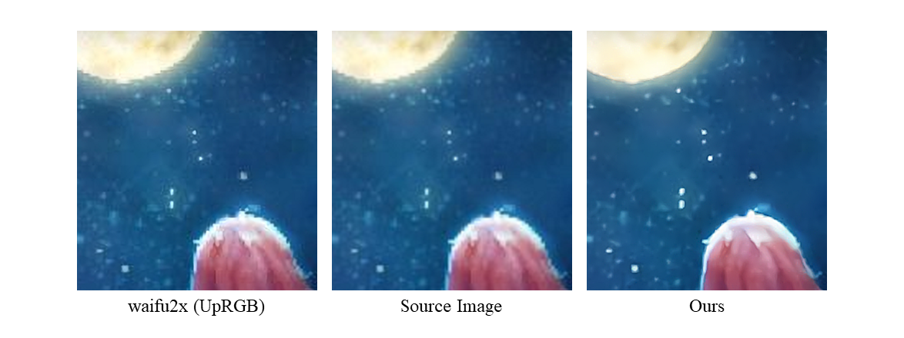

# lowres-waifu2x

A filter based on waifu2x specially optimized for low-resolution images.

Except for waifu2x, it does not include any neural networks.

100% purely composed of traditional algorithms.

## Mechanisms

Employed with a random number generator, the low-resolution image is undersampled to random sizes within a certain range. Thus pixels are randomly convolved with adjacent pixels, either above or below. The set of images are then delivered to an external `waifu2x` program to be supersampled to 4 times of the original size.

These supersampled images will be ultimately resized to the original dimensions and filtered with multiple functions. These functions are combined to a general output.

To ensure details are well preserved, images are processed separately in the categories of denoised or not. The two outputs are finally combined with a sigmoid function to avoid either losing dark details or overwhelmed by bright spots.

It is generally not advised to use this program on images larger than 1000x1000 as merely few significant improvements may be spectated, not to mention the huge performance downfall. Though, at low resolution images, we had achieved a better result.



This model is highly overfit to a certain type of image that holds extra low resolution. Using other images on this model would yield certain distressing artifacts.

## Installation

Python 3 is required before you use this program.

Install the dependencies through the following:

```bash
pip install -r requirements.txt
```

You must provide a usable waifu2x installation to the command argument, or the function itself.

The file should be located under the current working directory under the name `source.png`, and execute the script should yield `output.png` if everything works well.

```bash
python3 lowres_waifu2x.py /usr/bin/waifu2x-caffe-cui
```

Please note that this program is not under development, however improvements to make this program generally available on different platforms or easier to use are welcomed.

## License

This project is licensed under MIT License.
